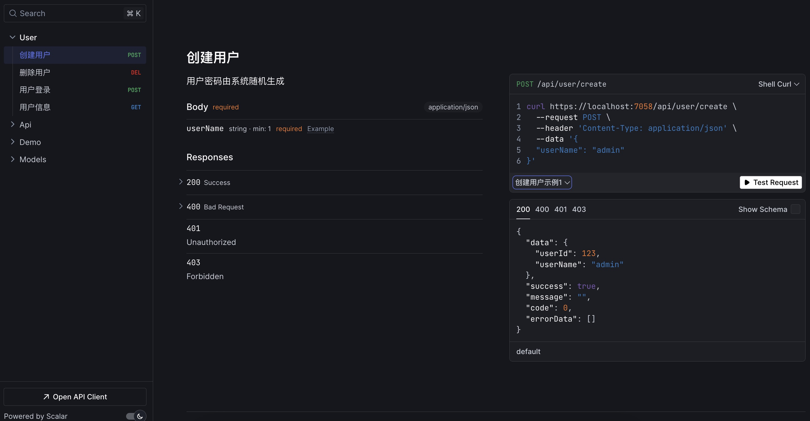

# My.FastNCP

## 简介

这是 [Netcorepal](https://github.com/netcorepal/netcorepal-cloud-framework) 与 [FastEndpoints](https://github.com/FastEndpoints/FastEndpoints) 两个框架搭配使用的示例代码，主要使用 `FastEndpoints` 的 [REPR](https://deviq.com/design-patterns/repr-design-pattern) 设计模式替代原先的Controller，以及fastendpints的身份认证/权限验证等相关功能

## 身份认证

### ApiKey 认证

这里简单的实现了 `ApiKey` 的身份认证方案，主要用于第三方对接，[查看代码](https://github.com/9kbx/ncp-fastendpoint/blob/main/src/My.FastNCP.Web/AspNetCore/ApiKey/ApikeyAuth.cs)

### 综合认证

同时支持 `Jwt` 和 `ApiKey` 等多种身份认证方案

```csharp
builder.Services
    // 添加Jwt身份认证方案
    .AddAuthenticationJwtBearer()
    .AddAuthentication(o =>
    {
        o.DefaultAuthenticateScheme = "Jwt_Or_ApiKey";
        o.DefaultChallengeScheme = "Jwt_Or_ApiKey";
    })
    // 添加 ApiKey 身份认证方案
    .AddScheme<AuthenticationSchemeOptions, ApikeyAuth>(ApikeyAuth.SchemeName, null)
    // 综合认证方案（使用jwt或apikey任意一个方案请求endpoint）
    // https://fast-endpoints.com/docs/security#combined-authentication-scheme
    .AddPolicyScheme("Jwt_Or_ApiKey", "Jwt_Or_ApiKey", o =>
    {
        o.ForwardDefaultSelector = ctx =>
        {
            if (ctx.Request.Headers.TryGetValue(HeaderNames.Authorization, out var authHeader) &&
                authHeader.FirstOrDefault()?.StartsWith("Bearer ") is true)
                return JwtBearerDefaults.AuthenticationScheme;

            return ApikeyAuth.SchemeName;
        };
    });
```

### JWT令牌管理

FastEndpoint 提供了令牌刷新和令牌吊销验证抽象

- [令牌刷新](https://fast-endpoints.com/docs/security#jwt-refresh-tokens)
- [令牌有效性验证](https://fast-endpoints.com/docs/security#jwt-token-revocation)

## 权限验证

### 设定权限

在Endpoint配置中指定权限代码

```csharp
public override void Configure()
{
    Post("/api/user/create");
    Permissions("user.create"); // 给当前webapi接口设定权限
}
```

### 默认权限验证

FastEndpoint 默认从 `principal.Claims["permission"]` 判断是否存在权限代码

### 动态权限验证

当系统有上百个权限代码时不建议在jwtToken保存用户的权限列表数据，而是通过 `IClaimTransformation` 来实现动态加载权限代码到 `principal.Claims`。

> IClaimsTransformation接口作用：
> 
> 在ASP.NET Core中，IClaimsTransformation 接口提供了一种在用户认证之后、授权策略执行之前修改或添加用户声明（Claims）的机制。
> 简单来说，它允许你在用户身份被验证后，但在系统根据这些身份信息判断用户是否有权限执行某个操作之前，对用户的身份信息进行“加工”。

```csharp
sealed class UserPermissionHydrator(UserPermissionService userPermissionService) : IClaimsTransformation
{
    public async Task<ClaimsPrincipal> TransformAsync(ClaimsPrincipal principal)
    {
        var userId = principal.Claims.FirstOrDefault(c => c.Type == ClaimTypes.NameIdentifier)?.Value;
        ArgumentNullException.ThrowIfNull(userId);

        // 从缓存读取所有权限代码加载到权限声明列表
        var userPermissions = await userPermissionService.GetPermissionsForUser(userId);
        if (userPermissions.Any())
            principal.AddIdentity(new(userPermissions.Select(p => new Claim("permissions", p))));

        return principal;
    }
}
```

## 代码片段快捷指令

+ 创建Endpoint：`epp`

```csharp
// 定义webapi接口
sealed class CreateUserEndpoint(IMediator mediator) : Endpoint<CreateUserRequest, ResponseData<CreateUserResponse>>
{
    // api配置
    public override void Configure()
    {
        Post("/api/user/create"); // api路由
        Description(x => x.WithTags("User")); // 路由分组
        // AllowAnonymous(); // 匿名访问，不调用则需要身份认证后才能访问
        Permissions("user.create"); // 权限验证，拥有user.create权限的用户才能访问
    }

    // 业务逻辑代码
    public override async Task HandleAsync(CreateUserRequest r, CancellationToken c)
    {
        // var password = PasswordHelper.NewPassword();
        var password = "1231231";
        var cmd = new CreateUserCommand(r.UserName, password);
        var result = await mediator.Send(cmd, c);
        var res = new CreateUserResponse(result.UserId, result.UserName);
        await SendOkAsync(res.AsResponseData(), c);
        
    }
}

// webapi请求对象
sealed record CreateUserRequest(string UserName);

// webapi响应对象
sealed record CreateUserResponse(long UserId, string UserName);

// webapi请求对象验证器
sealed class CreateUserValidator : Validator<CreateUserRequest>
{
    public CreateUserValidator()
    {
        RuleFor(x => x.UserName).NotEmpty();
    }
}

// webapi描述内容
sealed class CreateUserSummary : Summary<CreateUserEndpoint, CreateUserRequest>
{
    public CreateUserSummary()
    {
        Summary = "创建用户";
        Description = "用户密码由系统随机生成";
        // 给webapi文档添加请求响应示例
        RequestExamples.Add(new RequestExample(new CreateUserRequest("admin"), "创建用户示例1"));
        RequestExamples.Add(new RequestExample(new CreateUserRequest("admin22"), "创建用户示例2"));
        ResponseExamples.Add(200, new CreateUserResponse(123,"admin").AsResponseData());
    }
}
```

在 Scalar UI 上展示接口样例



### IDE 代码片段配置

- Rider默认支持，无需配置
- VS和VSCode参考: https://github.com/netcorepal/netcorepal-cloud-template/blob/main/README.md

### 可用的代码片段

#### NetCorePal (ncp) 快捷键

| 快捷键 | 描述            | 生成内容 |
|--------|---------------|----------|
| `ncpcmd` | NetCorePal 命令 | ICommand 实现(含验证器和处理器) |
| `ncpcmdres` | 命令(含返回值)      | ICommand&lt;Response&gt; 实现 |
| `ncpar` | 聚合根           | Entity&lt;Id&gt; 和 IAggregateRoot |
| `ncprepo` | NetCorePal 仓储 | IRepository 接口和实现 |
| `ncpde` | 领域事件          | IDomainEvent 记录 |
| `ncpdeh` | 领域事件处理器       | IDomainEventHandler 实现 |
| `ncpie` | 集成事件          | IntegrationEvent 和处理器 |
| `ncpiec` | 集成事件转换器       | IIntegrationEventConverter |

#### Fast-Endpoints (ep) 快捷键

| 快捷键 | 描述 | 生成内容 |
|--------|------|----------|
| `epp` | FastEndpoint(NCP风格) | 完整的垂直切片实现 |
| `epreq` | 仅请求端点 | Endpoint&lt;Request&gt; |
| `epres` | 仅响应端点 | EndpointWithoutRequest&lt;Response&gt; |
| `epdto` | 端点 DTOs | Request 和 Response 类 |
| `epval` | 端点验证器 | Validator&lt;Request&gt; |
| `epmap` | 端点映射器 | Mapper&lt;Request, Response, Entity&gt; |
| `epfull` | 完整端点切片 | 带映射器的完整实现 |
| `epsum` | 端点摘要 | Summary&lt;Endpoint, Request&gt; |
| `epnoreq` | 无请求端点 | EndpointWithoutRequest |
| `epreqres` | 请求响应端点 | Endpoint&lt;Request, Response&gt; |
| `epdat` | 端点数据 | 静态数据类 |

### 使用示例

#### 创建命令文件

- 在命令文件夹下创建 `CreateUserCommand.cs` 文件
- 在代码里输入 `ncpcmd` 生成命令和命令处理器相关代码

#### 创建webapi接口

- 在Endpoints文件夹下创建 `CreateUserEndpiont.cs` 文件
- 在代码里输入 `epp` 生成创建用户webapi接口的相关代码

#### 示例截图


